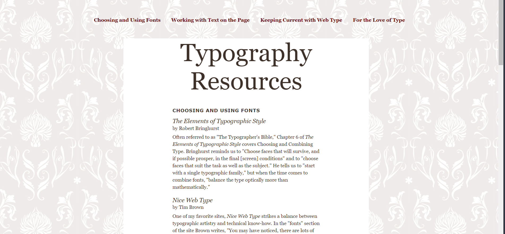
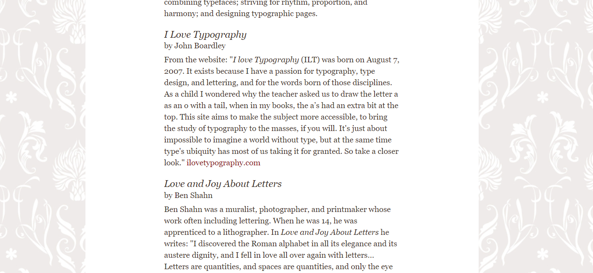

# Typography-Site

- Create a nav that has internal links to each of the sections
- Add the img as a background
- Each heading should have a font from Google Fonts
- Style each link so that it's background color changes on hover
- Use inline elements like `<em>`, `<strong>`, etc... where appropriate.

